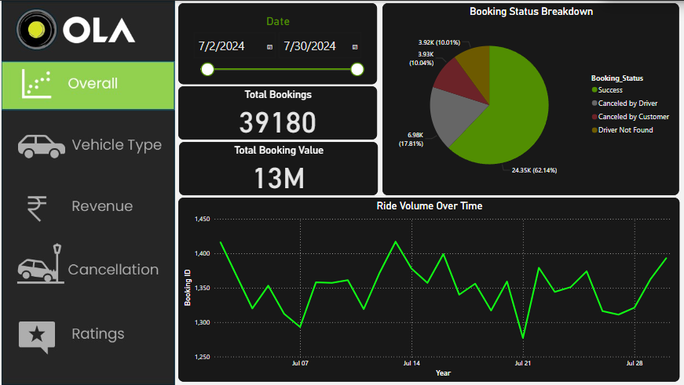

# 🚕 Ola Ride Data Analysis

Analyzed over **100,000 Ola ride bookings** using **Python**, **SQL**, and **Power BI** to uncover insights and improve ride completion rates. Applied machine learning and statistical techniques to reduce cancellations and optimize customer experience.

## 📌 Project Description

This project focuses on analyzing Ola ride data across **50+ Indian locations**. The objective was to explore key factors affecting ride cancellations and user behavior, and to develop actionable insights through data analytics and machine learning.

## 📊 Key Features

- ✅ Cleaned and preprocessed large-scale ride booking datasets  
- 📈 Performed Exploratory Data Analysis (EDA) to identify **peak times**, **surge pricing**, and **location trends**  
- 📉 Applied **logistic regression** to predict the probability of ride cancellations  
- 📊 Created **interactive dashboards** in Power BI for business stakeholders  
- 🧪 Conducted **A/B testing** to evaluate performance improvements

## 🧠 Tech Stack

- **Python** (Pandas, NumPy, scikit-learn, matplotlib, seaborn)
- **SQL** (data extraction and transformation)
- **Power BI** (data visualization and dashboard creation)

## 🛠️ Challenges Faced

- Managing and imputing **missing or inconsistent data**
- Balancing technical detail with **visual clarity** in dashboards

## 🔗 Links

- 🔍 [GitHub Repository](https://github.com/Hritik664/Ola-Ride-Data-Analysis)

## 📢 Insights Gained

- Identified key variables impacting ride cancellations, such as **pickup location**, **ride time**, and **user behavior**
- Demonstrated the value of combining **statistical analysis** with **interactive dashboards** for better decision-making

---

> This project showcases my ability to work on **real-world data problems**, perform **end-to-end analysis**, and communicate insights effectively. Ideal for roles in **Data Science**, **Business Analytics**, or **Product Strategy**.
